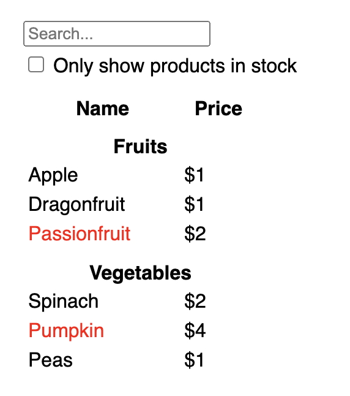
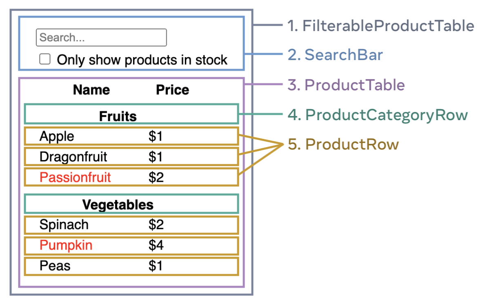

# Thinking in React <!-- omit in toc -->

When you build a user interface with React, you will first break it apart into pieces called components. Then, you will describe the different visual states for each of your components. Finally, you will connect your components together so that the data flows through them. In this tutorial, we’ll guide you through the thought process of building a searchable product data table with React.

# Table of Contents <!-- omit in toc -->

- [Start with a mockup](#start-with-a-mockup)
- [Step 1: Break the UI into a component hierarchy](#step-1-break-the-ui-into-a-component-hierarchy)
- [Step 2: Build a static version in React](#step-2-build-a-static-version-in-react)

# Start with a mockup

Imagine that you already have a JSON API and a mockup from a designer.

The JSON API returns some data that looks like this:

```json
// prettier-ignore
[
  { category: "Fruits", price: "$1", stocked: true, name: "Apple" },
  { category: "Fruits", price: "$1", stocked: true, name: "Dragonfruit" },
  { category: "Fruits", price: "$2", stocked: false, name: "Passionfruit" },
  { category: "Vegetables", price: "$2", stocked: true, name: "Spinach" },
  { category: "Vegetables", price: "$4", stocked: false, name: "Pumpkin" },
  { category: "Vegetables", price: "$1", stocked: true, name: "Peas" }
]
```

The mockup looks like this:



To implement a UI in React, you will usually follow the same five steps:

# Step 1: Break the UI into a component hierarchy

Start by drawing boxes around every component and subcomponent in the mockup and naming them.

You can think about splitting up a design into components in this way:

> A component should ideally only be concerned with one thing. If it ends up growing, it should be decomposed into smaller subcomponents.

If your JSON is well-structured, you’ll often find that it naturally maps to the component structure of your UI. Separate your UI into components, where each component matches one piece of your data model.

There are five components on this screen:



1. `FilterableProductTable` (grey) contains the entire app.
2. `SearchBar` (blue) receives the user input.
3. `ProductTable` (lavender) displays and filters the list according to the user input.
4. `ProductCategoryRow` (green) displays a heading for each category.
5. `ProductRow` (yellow) displays a row for each product.

If you look at `ProductTable` (lavender), you’ll see that the table header (containing the “Name” and “Price” labels) isn’t its own component. This is a matter of preference. For this example, it is a part of `ProductTable` because it appears inside the `ProductTable`’s list. However, if this header grows to be complex (e.g., if you add sorting), you can move it into its own `ProductTableHeader` component.

Now that you’ve identified the components in the mockup, arrange them into a hierarchy:

- FilterableProductTable
  - SearchBar
  - ProductTable
    - ProductCategoryRow
    - ProductRow

# Step 2: Build a static version in React

Now, it’s time to implement your app. It’s often easier to build the static version first and add interactivity later. Building a static version requires a lot of typing and no thinking, but adding interactivity requires a lot of thinking and not a lot of typing.

To build a static version of your app that renders your data model, you’ll want to build components that reuse other components and pass data using props. Props are a way of passing data from parent to child. (don’t use state at all to build this static version. State is reserved only for interactivity, that is, data that changes over time.)

You can either build “top down” by starting with building the components higher up in the hierarchy (like `FilterableProductTable`) or “bottom up” by working from components lower down (like `ProductRow`). In simpler examples, it’s usually easier to go top-down, and on larger projects, it’s easier to go bottom-up.

First, create a React app by following [this link](https://github.com/ttanvirr/react-starter) (Only basic setup with javascript)

In the `App.js` file, replace everything with the following:

```jsx
function SearchBar() {
  return (
    <form>
      <input type="text" placeholder="Search..." />
      <br />
      <label>
        <input type="checkbox" /> Only show products in stock
      </label>
    </form>
  )
}

function ProductCategoryRow({ category }) {
  return (
    <tr>
      <th colSpan="2">{category}</th>
    </tr>
  )
}
function ProductRow({ product }) {
  return (
    <tr>
      <td>
        {product.stocked ? (
          product.name
        ) : (
          <span style={{ color: "red" }}>{product.name}</span>
        )}
      </td>
      <td align="right">{product.price}</td>
    </tr>
  )
}

function ProductTable({ products }) {
  let lastCategory = null
  const rows = []

  products.forEach((product) => {
    if (product.category !== lastCategory) {
      rows.push(
        <ProductCategoryRow
          category={product.category}
          key={product.category}
        />,
      )
    }

    rows.push(<ProductRow product={product} key={product.name} />)

    lastCategory = product.category
  })

  return (
    <table>
      <thead>
        <tr>
          <th>Name</th>
          <th>Price</th>
        </tr>
      </thead>

      <tbody>{rows}</tbody>
    </table>
  )
}
function FilterableProductTable({ products }) {
  return (
    <div>
      <SearchBar />
      <ProductTable products={products} />
    </div>
  )
}

const PRODUCTS = [
  { category: "Fruits", price: "$1", stocked: true, name: "Apple" },
  { category: "Fruits", price: "$1", stocked: true, name: "Dragonfruit" },
  { category: "Fruits", price: "$2", stocked: false, name: "Passionfruit" },
  { category: "Vegetables", price: "$2", stocked: true, name: "Spinach" },
  { category: "Vegetables", price: "$4", stocked: false, name: "Pumpkin" },
  { category: "Vegetables", price: "$1", stocked: true, name: "Peas" },
]

function App() {
  return <FilterableProductTable products={PRODUCTS} />
}

export default App
```
